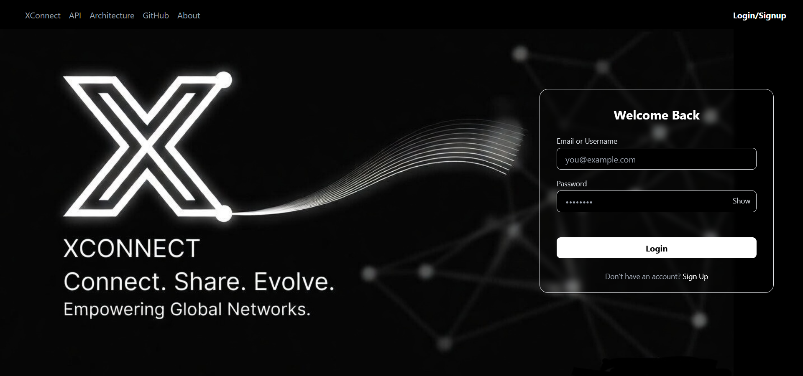

# XConnect 🚀  
A distributed real-time social platform with live streaming (WebRTC SFU),
chunked video processing (FFmpeg + HLS), and event-driven architecture.

XConnect enables users to connect, stream live, upload media, send superchats, receive real-time notifications, and interact through secure and scalable architecture.




---

## Live Links 
Live Applicatioon - https://xconnect.vercel.app/
APi Docs - swagger

---

## Features

### Authentication
- JWT-based login and secure cookies
- Protected routes
- Refresh token system
  
### Social Platform
- Create and manage posts
- Like and comment on posts
- Follow and unfollow users
- Personalized feed system
- User profiles and activity
- Media posts (image and video)

### Media Upload
- Chunked video upload
- FFmpeg processing
- HLS streaming
- Supabase storage
- Cloudinary thumbnails

### Real-Time Communication
- WebRTC live streaming
- Mediasoup SFU
- Socket.io signaling
- Video.js playback

### Notifications
- Real-time socket notifications
- Persistent notification storage

### SuperChat
- Stripe payment integration
- Live stream superchat messages

### Security
- Rate limiting
- Helmet
- CORS
- Global error handling
- Web Security & API Protection

### DevOps
- GitHub Actions CI
- Automated testing
- Deployment pipeline

---

## High-Level Architecture Diagram
```
            Client (React)
                 │
     ┌───────────┼───────────┐
     │           │           │
 REST API    Socket.io    Media Pipeline
 (Express)   (Realtime)   (FFmpeg)
     │           │           │
  MongoDB     Mediasoup    HLS + Storage
                │
           Stripe / Cloudinary
```
### [More Detailed Architecture Link](./Backend/docs/architecture.md)  

---

## Project Preview
  ``A few screenshots of the application yet to add``
## Demo

### Authentication Flow


### Media Upload Flow


### Live Streaming


##  Tech Stack

| Area              | Tech                                                             |
|-------------------|------------------------------------------------------------------|
| Frontend          | React , Tailwind Css, Rdux Toolkit , RTK Query , Vite , Video.js |
| Backend           | Node.js , Express , Mongo Atlas , Mongoose                       |
| Real-Time Coms    | Mediasoup , Socket.io , WebRTC                                   |
| Media Processing  | Multer , ffmpeg , HLS                                            |
| Payments          | Stripe                                                           |
| Storage           | Cloudinary , Supabase                                            |  
| Security          | Helmet, CORS, Rate Limiting, JWT, Http only Cookies, Zod         |
| Backend Testing   | supertest + Jest                                                 |
| Dev Ops           | Github , vercel , render                                         |
| API Docs          | Swagger                                                          |

---
## Project Structure

```text
XConnect
  │
  ├── Backend
  │   ├── controllers
  │   ├── routes
  │   ├── models
  │   ├── middleware
  │   ├── utils
  │   ├── tests
  │   ├── server.js
  |   ├── swagger.js
  │   └── app.js
  │
  ├── Frontend
  │   ├── src
  │       ├── components
  |       ├── layout
  |       ├── constants
  │       ├── pages
  │       ├── redux
  |       ├── api
  |       ├── main.jsx
  │       └── app.jsx
  │
  └── README.md
  ```
---

## Installation

Clone the repository
```text
git clone https://github.com/VivekDudi-Github/Xconnect.git
cd xconnect
```
Backend :
```text
cd Backend
npm install
npm run dev
```

For Stripe 
```text
stripe listen --forward-to localhost:3000/api/v1/stripe/webhook
```
Frontend :
```text
cd Frontend
npm install
npm run dev
```
### Running tests
```text
cd Backend
npm run test
```
---
## Environment Variables
```text
Backend:
PORT=
MONGO_URL=
ACCESS_TOKEN_SECRET=
ACCESS_TOKEN_SECRET_EXPIRES_IN=
REFRESH_TOKEN_SECRET=
REFRESH_TOKEN_SECRET_EXPIRES_IN=

PUBLISHABLE_STRIPE_KEY=
STRIPE_SECRET_KEY=
WEBHOOK_KEY=

SUPABASE_URL=
SUPABASE_API_KEY=
SUPABASE_VIDEO_BUCKET
CLOUDINARY_CLOUD_NAME=
CLOUDINARY_API_KEY=
CLOUDINARY_API_SECRET=

Frontend:
VITE_STRIPE_PUBLISHABLE_KEY=
```
---

## Future Improvements

- Creator payout system
- Advanced analytics
- Scalable media workers
- Kubernetes deployment
- Redis caching

---

## Author

Vivek Dudi

GitHub: https://github.com/VivekDudi-Github
LinkedIn: VivekDudi-LinkedIn

---