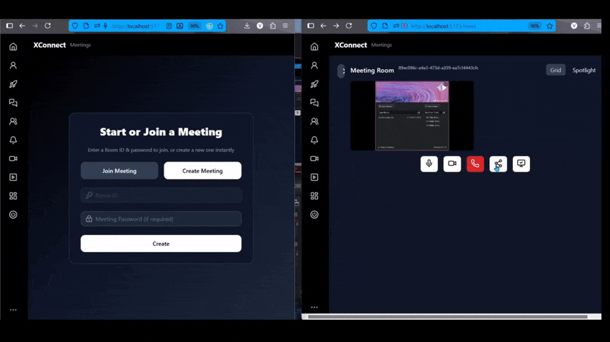
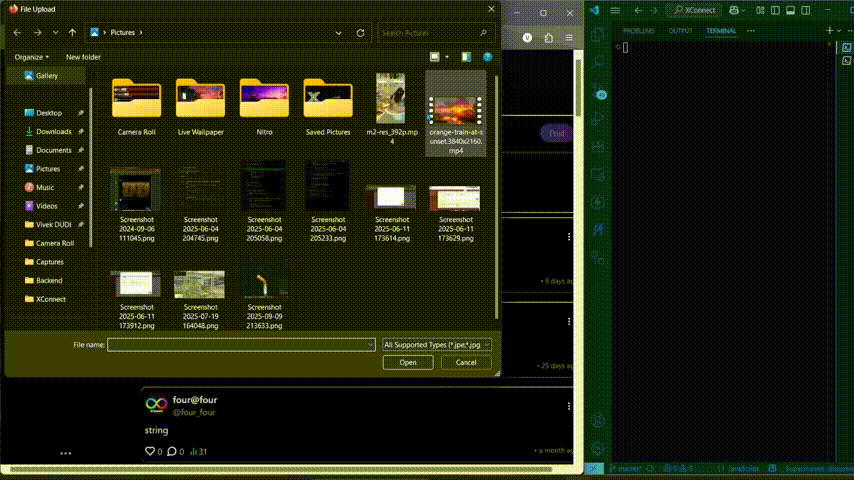
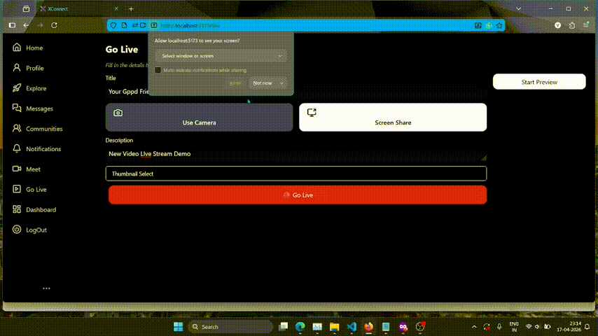
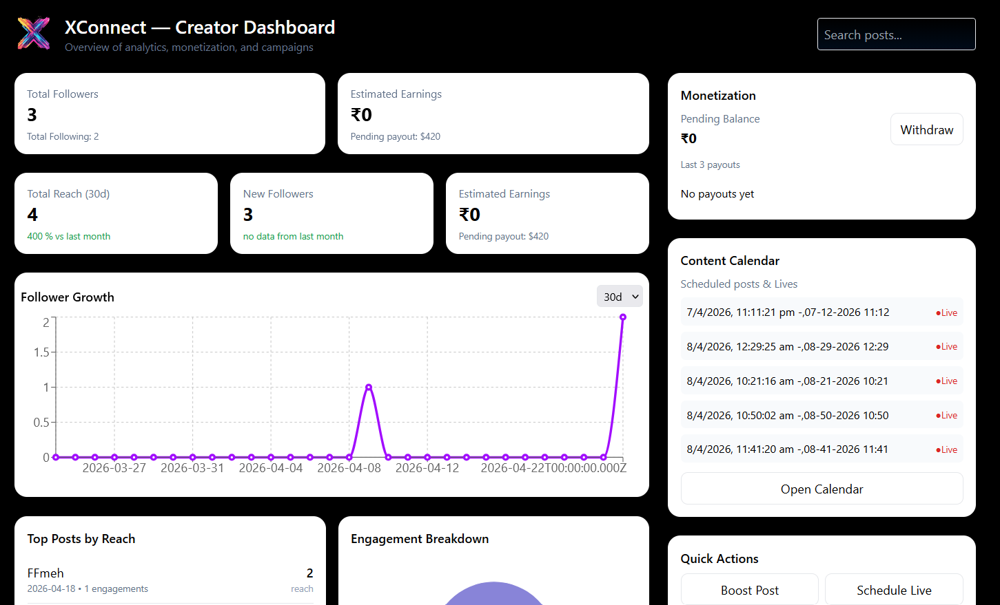
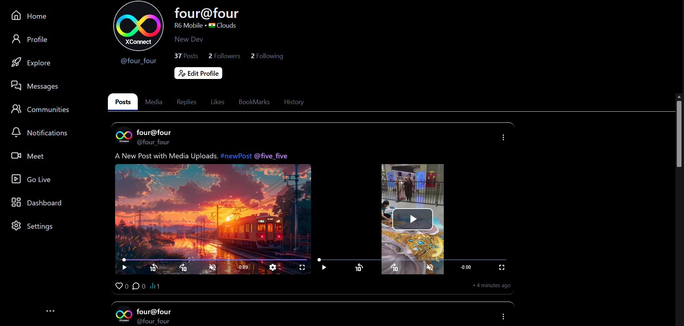
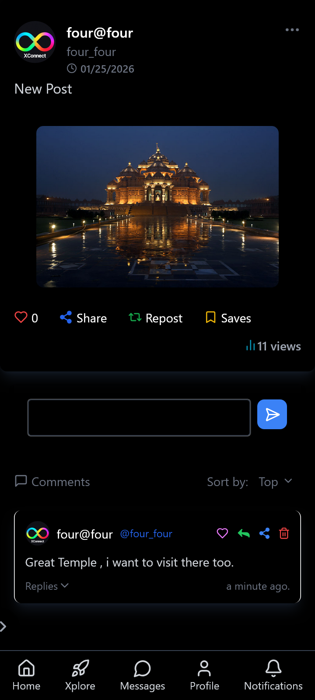
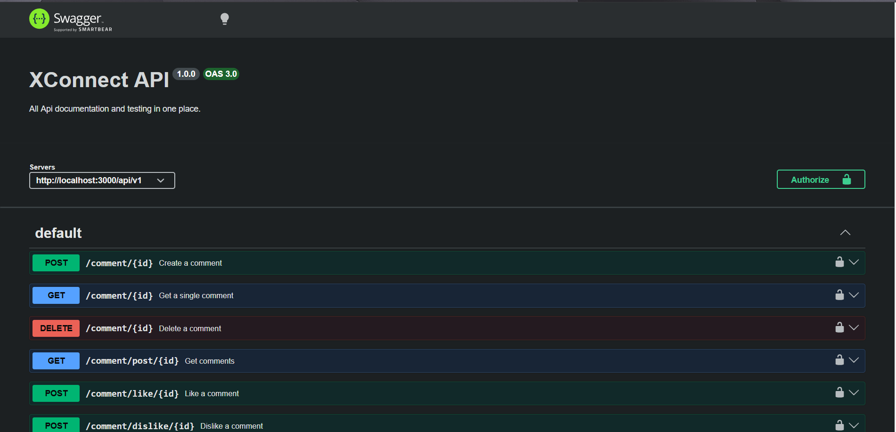

# XConnect 🚀  
XConnect is a full-stack real-time social media and live streaming platform built using a modular and scalable architecture. The system integrates REST APIs, WebRTC-based streaming, real-time communication, and media processing pipelines.

### Meeting 

</br>
*Multi-user video conferencing with mediasoup SFU and simulcast support*

It enables users to connect, stream live, upload media, send superchats, receive real-time notifications, and interact through secure and scalable architecture.

---

## Live Links 
- 🌐 Live App: https://xconnect.ddns.net/
- 📘 API Docs (Swagger): https://xconnect.ddns.net/serve/api-docs

---


## Demo
### Media Upload 

<br/>
*Resumable media uploads, multi quality video and thumbnail generation using FFmpeg* 

### Live Stream

<br/>
*Real-time live streaming with WebRTC SFU and instant SuperChat payments*

## Core System Features

- Real-time streaming via WebRTC SFU
- Chunked Resumable video upload + FFmpeg processing (HLS) 
- Event-driven notifications using sockets
- SuperChat payments via Stripe Webhooks
- Meeting and call with mediasoup SFU with simulcast support
- Swagger Documentation
- Full Dockerized Backend & Nginx reverse proxy
- BullMQ for Background FFmpeg jobs
- Redis Caching For Faster Performance
- Redux Store, Caching & Query Mangement 
- CI/CD Pipeline managing automated testing, builds & deploy containers 
---

## High-Level Architecture Diagram
```
                      Client (React)
                          │
                      AWS[Docker]
                          |
                        Nginx
                          |
                        Node.js
                          |
            ┌─────────────┼─────────────┐
            │             │             │
        REST API      Socket.io      Media Pipeline
        (Express)     (Realtime)     (FFmpeg)
            │             │             │
          MongoDB      Mediasoup      HLS + Storage
                      
                      
```
### [More Detailed Architecture Link](./docs/architecture.md)  
----

## UI and System Preview
  <div align="center">
    <p><b>Analytics Dashboard</b> &nbsp;&nbsp;&nbsp;&nbsp;&nbsp;&nbsp;&nbsp;&nbsp;&nbsp; <b>User Profile</b></p>
    
    
  </div>
  <div style="height:2px; background-color: #444; width: 100%; margin: 20px 0px;"></div>
  <div align="center" style="margin-top: 0px;">
    <p><b>Mobile Post View</b> &nbsp;&nbsp;&nbsp;&nbsp;&nbsp;&nbsp;&nbsp;&nbsp; <b>API Documentation (Swagger)</b></p>
    
    
  </div>


##  Tech Stack

| Area              | Tech                                                             |
|-------------------|------------------------------------------------------------------|
| Frontend          | React , Tailwind Css, Redux Toolkit , RTK Query , Vite, Video.js |
| Backend           | Node.js , Express , Mongo Atlas , Mongoose                       |
| Real-Time Comms   | Mediasoup , Socket.io , WebRTC                                   |
| Media Processing  | Multer , FFmpeg , HLS                                            |
| Dev Ops           | GitHub Actions, AWS EC2, Nginx, Docker, Redis, BullMQ            |
| Storage           | Cloudinary , Supabase                                            |
| Security          | Helmet, CORS, Rate Limiting, JWT, Http only Cookies, Zod         |
| Backend Testing   | supertest + Jest                                                 |
| Payments          | Stripe                                                           |
| API Docs          | Swagger , OpenApi                                                |

---


## Directory Structure

```text
XConnect
  │
  ├── Backend
  │   ├── modules
  │   ├── routes
  │   ├── models
  │   ├── middleware
  │   ├── utils
  │   ├── tests
  │   ├── server.js
  │   ├── swagger.js
  │   └── app.js
  │
  ├── Frontend
  │   └── src
  │       ├── components
  │       ├── layout
  │       ├── constants
  │       ├── pages
  │       ├── redux
  │       ├── api
  │       ├── main.jsx
  │       └── app.jsx
  ├── nginx
  │   ├── nginx.dev.conf
  │   └── nginx.prod.conf
  │
  ├── .github
  │   └── workflows
  │       └── backend-ci.yml
  │
  ├── docker-compose.dev.yml
  ├── docker-compose.prod.yml
  │
  ├── nginx.dev.Dockerfile
  ├── nginx.prod.Dockerfile
  │
  └── README.md

  ```
---

## Installation

Clone the repository
```text
git clone https://github.com/VivekDudi-Github/Xconnect.git
cd xconnect
```
Backend :
```text
cd Backend
npm install
npm run dev
```

For Stripe 
```text
stripe listen --forward-to localhost:3000/api/v1/stripe/webhook
```
Frontend :
```text
cd Frontend
npm install
npm run dev
```
### Running tests
```text
cd Backend
npm run test
```
---
## Environment Variables
### Backend:
```text
PORT=
MONGO_URL=
ACCESS_TOKEN_SECRET=
ACCESS_TOKEN_SECRET_EXPIRES_IN=
REFRESH_TOKEN_SECRET=
REFRESH_TOKEN_SECRET_EXPIRES_IN=

PUBLISHABLE_STRIPE_KEY=
STRIPE_SECRET_KEY=
WEBHOOK_KEY=

SUPABASE_URL=
SUPABASE_API_KEY=
SUPABASE_VIDEO_BUCKET
CLOUDINARY_CLOUD_NAME=
CLOUDINARY_API_KEY=
CLOUDINARY_API_SECRET=

REDIS_HOST='redis'
REDIS_PORT= '6379'

```
### Frontend:
```text
VITE_STRIPE_PUBLISHABLE_KEY=
VITE_PRODUCTION_URL =
VITE_DEVELOPMENT_URL =
```
---

## Future Improvements

- Creator payout system
- Advanced analytics
- Scalable media workers
- SVC suppport on mediasoup

---

## Detailed Features list

### Authentication
- JWT-based login and secure cookies
- Refresh and access token system
  
### Social Platform
- Create and manage posts
- Follow - unfollow & like, comment
- Personalized feed system & trending page

### Media Upload
- Chunked video upload
- FFmpeg processing
- HLS streaming
- Dedicated bucket storage

### Real-Time Communication
- WebRTC live streaming
- Mediasoup SFU
- Socket.io signaling 
- Real Time Chats
- Video.js playback

### Notifications
- Real-time socket notifications
- Persistent notification storage

### SuperChat
- Stripe payment integration
- Live stream superchat messages

### Security
- Rate limiting , Helmet , CORS and global error handling

### DevOps
- GitHub Actions CI with automated testing
- Deployment pipeline
- Dockerized Backend & Nginx reverse proxy
- BullMQ for Background FFmpeg jobs
- Uses Redis for caching the Trending Page


## Author

Vivek Dudi

GitHub: https://github.com/VivekDudi-Github 
<br/>
LinkedIn: https://www.linkedin.com/in/vivek-dudi

---
